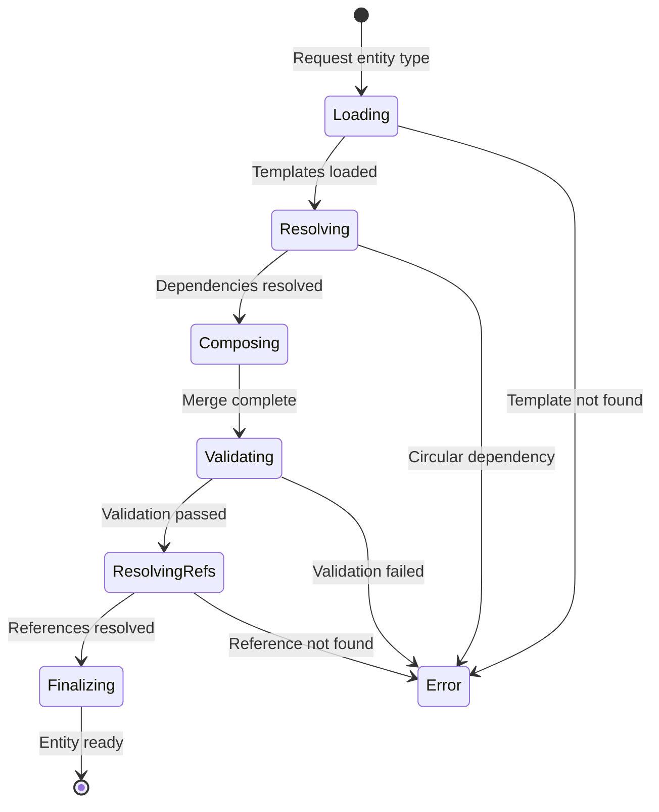

# Composition Engine Architecture

## Overview

The Composition Engine is a specification for assembling Storynaram entities from template definitions. It defines the rules, stages, and data flow for converting abstract templates into concrete entity documents.

## Core Concepts

### Template
A `.template.json` file defining a reusable structure. Two categories:
- **Base templates** — Foundational blocks (BaseEntity, BaseIdentifier, etc.)
- **Domain templates** — Entity-specific structures (Character, Book, etc.)

### Entity Document
A concrete JSON instance created by composing one or more templates and filling in values.

### Inheritance
A template may inherit from exactly one parent template (single inheritance). BaseEntity is the root of all inheritance chains.

### Composition
A template composes multiple base blocks (e.g. Character composes BaseIdentifier + BaseMetadata + BaseAudit + ...). Composition is many-to-many.

### Registry
A JSON file that catalogs templates, entities, relationships, and their metadata. All registries are populated at build time and consulted at composition time.

## Architecture Layers

```
┌──────────────────────────────────────────────┐
│                 Plugin Layer                  │
│  Extensions · Custom Fields · Validators     │
├──────────────────────────────────────────────┤
│            Composition Engine                 │
│  Load · Resolve · Merge · Validate · Finalize│
├──────────────────────────────────────────────┤
│            Template Registry                  │
│  Base · Domain · Extension · Plugin          │
├──────────────────────────────────────────────┤
│         Template Definitions                  │
│  templates/base/ · templates/domain/         │
├──────────────────────────────────────────────┤
│         Entity Documents                      │
│  characters/char_000001.json                 │
└──────────────────────────────────────────────┘
```

## Key Components

| Component | Responsibility |
|-----------|---------------|
| Template Loader | Loads template definitions from disk/registry |
| Dependency Resolver | Resolves load order, detects circular deps |
| Composition Engine | Merges templates into unified structure |
| Override Validator | Enforces override rules and precedence |
| Validation Pipeline | Applies validation rules in order |
| Reference Resolver | Resolves cross-entity references |
| Version Resolver | Checks template/schema version compatibility |
| Plugin Loader | Loads and applies plugin extensions |
| Cache | Caches composed results by template hash |

## Entity Assembly Formula

```
EntityDocument = Compose(
    BaseEntity.template,
    BaseBlock₁.template, ..., BaseBlockₙ.template,
    DomainTemplate.template,
    PluginExtensions₁, ..., PluginExtensionsₙ,
    UserValues
)
```

## State Machine


