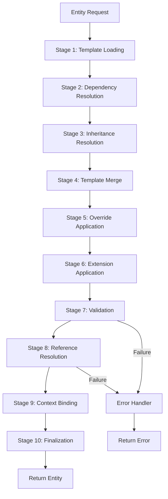

# Composition Pipeline

## End-to-End Assembly Process

### Pipeline Flow



### Character Assembly Example

```
Request: character/char_000001

Stage 1: Load Templates
├── templates/base/BaseEntity.template.json
├── templates/base/BaseIdentifier.template.json
├── templates/base/BaseMetadata.template.json
├── templates/base/BaseAudit.template.json
├── templates/base/BaseVersion.template.json
├── templates/base/BaseStatus.template.json
├── templates/base/BaseLifecycle.template.json
├── templates/base/BaseOwnership.template.json
├── templates/base/BaseReference.template.json
├── templates/base/BaseRelationship.template.json
├── templates/base/BaseTag.template.json
├── templates/base/BaseVisibility.template.json
├── templates/base/BaseLocalization.template.json
├── templates/base/BaseAttachment.template.json
├── templates/base/BaseValidation.template.json
├── templates/base/BaseAI.template.json
├── templates/base/BaseSearch.template.json
├── templates/base/BaseHistory.template.json
├── templates/base/BaseExtension.template.json
├── templates/domain/Character.template.json
└── plugins/active/*.json

Stage 2: Resolve Dependencies
├── Character depends on BaseEntity
├── BaseEntity depends on BaseIdentifier, BaseMetadata, BaseAudit
├── BaseStatus depends on config/id_rules.json
└── All dependencies resolved → linear load order

Stage 3: Resolve Inheritance
├── Character extends BaseEntity (depth 1)
├── BaseEntity is root (depth 0)
└── Flat inheritance chain: [BaseEntity, Character]

Stage 4: Merge Templates
├── Deep merge BaseIdentifier → BaseEntity → Character
├── Arrays concatenated
├── Primitives: entity-specific wins over base
└── Composition tree flattened

Stage 5: Apply Overrides
├── Final fields from base templates preserved
├── Overrideable fields from domain template applied
└── Custom values from request applied last

Stage 6: Apply Extensions
├── Plugin extensions injected
├── Custom fields from extension block applied
└── Custom metadata merged

Stage 7: Validate
├── 1. Template exists ✓
├── 2. Inheritance valid ✓
├── 3. Dependencies valid ✓
├── 4. Merge valid ✓
├── 5. Override rules valid ✓
├── 6. Required fields present ✓
├── 7. Field validation (regex, enum, length) ✓
├── 8. Reference validation (all IDs resolvable) ✓
├── 9. Business rules ✓
└── 10. AI validation ✓

Stage 8: Resolve References
├── entity.books → resolve to Book entities
├── entity.scenes → resolve to Scene entities
├── entity.currentLocation → resolve to Location entity
└── All references resolved

Stage 9: Bind Context
├── EntityContext attached
├── AIContext attached
├── ValidationContext attached
└── SessionContext attached

Stage 10: Finalize
├── Compose final JSON document
├── Cache composition result
├── Log composition audit event
└── Return ready entity
```

## Pipeline Operators

| Operator | Input | Output |
|----------|-------|--------|
| `load(type)` | Entity type | Template definitions |
| `resolve(templates)` | Template list | Ordered dependency graph |
| `inherit(chain)` | Inheritance chain | Flattened template tree |
| `merge(templates)` | Template set | Unified template object |
| `override(template, values)` | Template + overrides | Applied template |
| `extend(template, plugins)` | Template + plugins | Extended template |
| `validate(template)` | Template | Validation result |
| `resolveRefs(template)` | Template | Resolved references |
| `bind(template, context)` | Template + context | Context-bound template |
| `finalize(template)` | Template | Entity document |
