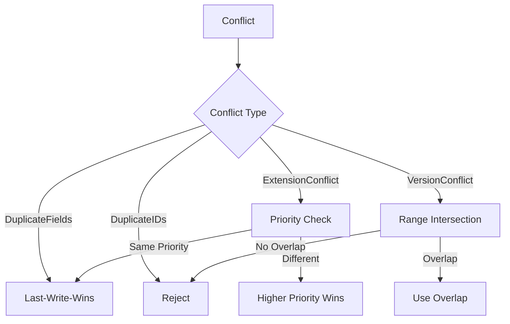

# Conflict Resolution

## Conflict Types

| Type | Description | Example |
|------|-------------|---------|
| DuplicateFields | Same field defined in two sources | `stats.hp` in domain + entity |
| DuplicateReferences | Same reference ID from multiple sources | `refs: [$char1, $char1]` |
| DuplicateIDs | Same `$id` in two templates | Two templates with `$id: player` |
| DuplicateRelationships | Same relationship declared twice | `relatesTo: [npc:guard]` twice |
| ExtensionConflicts | Two extensions modifying same field | Ext A and Ext B both set `color` |
| PluginConflicts | Two plugins providing same component | Plugin A and B both add `inventory` |
| ValidationConflicts | Two validators disagree | Stage 7 and Stage 9 produce opposite results |
| VersionConflicts | Incompatible version requirements | Dep A needs `^1.0`, Dep B needs `^2.0` |

## Resolution Strategies

| Conflict Type | Default Strategy | Alternative |
|---------------|-----------------|-------------|
| DuplicateFields | Last-write-wins | Merge (for objects) |
| DuplicateReferences | Deduplication | Reject |
| DuplicateIDs | Reject | Manual override |
| DuplicateRelationships | Deduplication | Merge |
| ExtensionConflicts | Last-registered wins | Priority-based |
| PluginConflicts | Last-registered wins | Reject |
| ValidationConflicts | Most restrictive wins | Configurable |
| VersionConflicts | Reject | Range intersection |

## Decision Matrix

## Manual Resolution

Conflicts with `resolution: manual` are written to a conflict report and composition is paused. A human operator must resolve and re-trigger.
