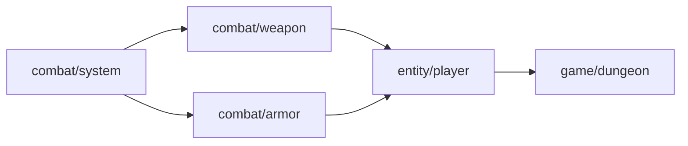

# Dependency Resolution

## Dependency Graph

Each template declares dependencies in its frontmatter:

```yaml
dependencies:
  - template: combat/system
    version: ">=1.0"
    optional: false
  - template: dialogue/format
    version: "^2.3"
    optional: true
```

## Load Order via Topological Sort

1. Build a directed graph of all template dependencies.
2. Perform Kahn's algorithm (BFS-based topological sort).
3. Load templates in sorted order — dependencies before dependents.



## Circular Dependency Detection

- Run Tarjan's SCC (strongly connected components) before processing.
- Any SCC with size > 1 is a circular dependency.
- **Fail-fast**: reject the entire composition with `CircularDependency` error listing the cycle.

## Missing Dependency Handling

| Dependency Type | Behavior |
|----------------|----------|
| Required + Missing | Error: `MissingDependency` |
| Optional + Missing | Warning logged, template excluded |
| Required + Wrong Version | Error: `InvalidVersion` |

## Optional Dependency Resolution

1. Attempt to resolve normally.
2. If unavailable, emit a warning and proceed.
3. All fields from the optional dependency must be marked `optional: true` in the depending template or guarded with `if-present` conditionals.
