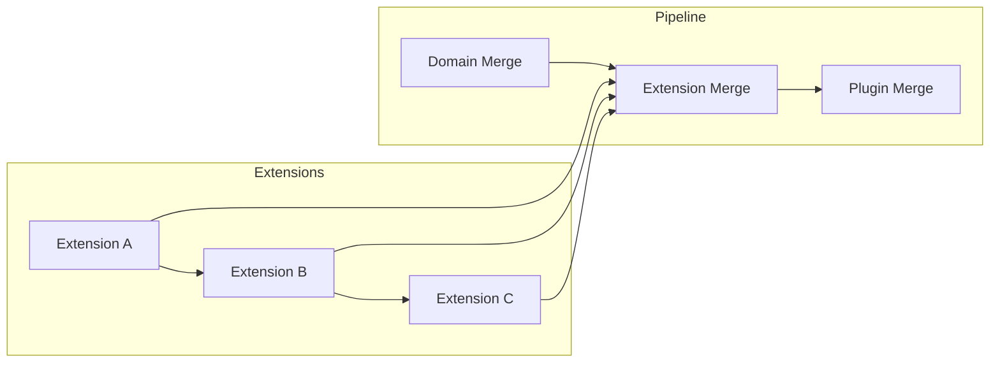

# Extension System

## Extension Point Architecture

Extensions register via extension points — well-defined hooks in the composition pipeline.

## 6 Extension Point Types

| Point | Registration | Trigger | Purpose |
|-------|-------------|---------|---------|
| `customFields` | `extend.fields` | Pre-merge | Add new fields to a template |
| `customMetadata` | `extend.metadata` | Pre-merge | Inject metadata blocks |
| `customComponents` | `extend.components` | Post-merge | Append reusable components |
| `schemaExtensions` | `extend.schema` | Pre-validation | Extend schema validation rules |
| `pluginRegistrations` | `extend.plugins` | Init phase | Register companion plugins |
| `hooks` | `extend.hooks` | Any stage | Lifecycle callbacks |

## Loading Order

1. Extensions are loaded in registration order.
2. If an extension declares `dependsOn`, it loads after its dependencies.
3. Extension fields are merged after domain templates but before plugins.



## Extension Precedence

If two extensions add the same field, the later-registered extension wins. Extensions may declare a `priority` value (lower = higher priority) that overrides registration order.

## Extension Contract

```yaml
$schema: extension
name: my-extension
version: "1.0.0"
extends: entity/character
point: customFields
priority: 100
dependsOn: [other-extension]
```
