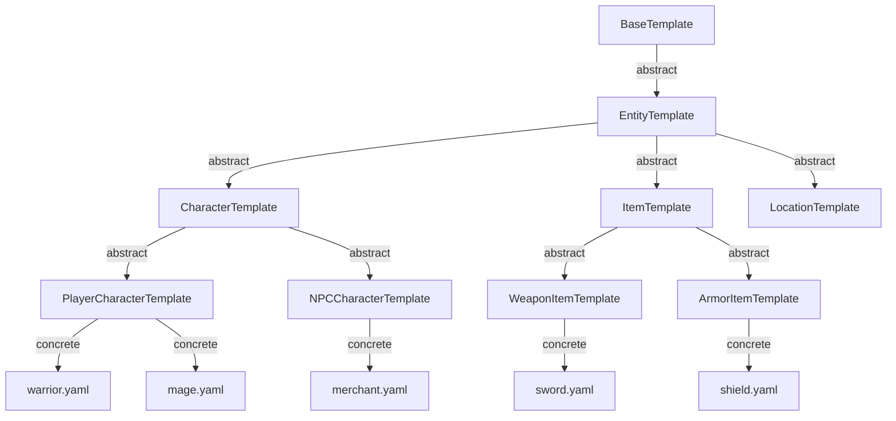

# Inheritance Model

## Overview

The composition system uses **single inheritance** combined with **multiple composition**. Each template inherits from exactly one parent (or `BaseTemplate`) and may compose multiple domain templates, extensions, and plugins.

## Abstract vs Concrete Templates

| Type | Instantiable | Purpose |
|------|-------------|---------|
| **Abstract Template** | No | Defines shape, required fields, validation rules. Never used directly. |
| **Concrete Template** | Yes | Fully resolved entity template. All abstract ancestors must be resolved. |

## Inheritance Chain

Each template declares a single `inherits` field. The chain terminates at `BaseTemplate`.

```
BaseTemplate (abstract)
 └── EntityTemplate (abstract)
      └── CharacterTemplate (abstract)
           └── PlayerCharacterTemplate (concrete)
```

## Composition Model

Alongside inheritance, a template composes zero or more **domain modules** via `composes`:

```yaml
composes:
  - domain: combat
  - domain: dialogue
    version: ">=1.2"
```

## Mermaid Inheritance Tree



## Rules

1. No diamond inheritance — single parent only.
2. Abstract templates cannot be instantiated as entities.
3. A concrete template must resolve every abstract field up the chain.
4. Domain composition adds fields but does not create parent-child relationships.
5. Inheritance depth is limited to 6 levels (configurable).
