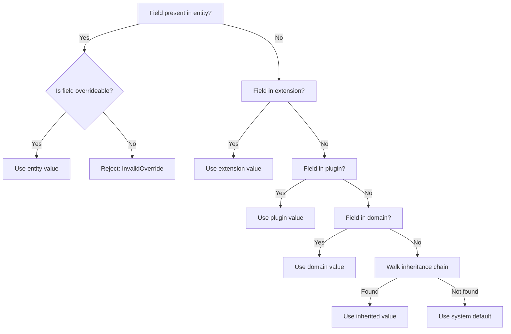

# Override Rules

## Field Precedence

Override resolution follows a strict precedence hierarchy (highest to lowest):

| Priority | Source | Description |
|----------|--------|-------------|
| 1 (highest) | Entity Document | Per-instance field values |
| 2 | Extension Fields | Added by extensions |
| 3 | Plugin Fields | Added by plugins |
| 4 | Domain Templates | Composition modules |
| 5 | Inherited Templates | Parent chain |
| 6 | Base Template | Root defaults |
| 7 (lowest) | System Defaults | Hardcoded fallbacks |

## Field Modifiers

Every field in a template can declare an override modifier:

| Modifier | Inherits? | Overrideable? | Can be set by Entity? |
|----------|-----------|---------------|----------------------|
| `final` | Yes | No | No |
| `protected` | Yes | Child templates only | No |
| `overrideable` | Yes | Yes | Yes |
| `entity-only` | No | No | Yes |
| `extension-only` | No | Extensions only | No |
| `plugin-only` | No | Plugins only | No |
| `reserved` | No | No | No |

### Reserved Fields

Reserved fields cannot be used in any template, entity, extension, or plugin:

```
$schema, $id, $type, inherits, composes, version, template
```

## Precedence Decision Logic


