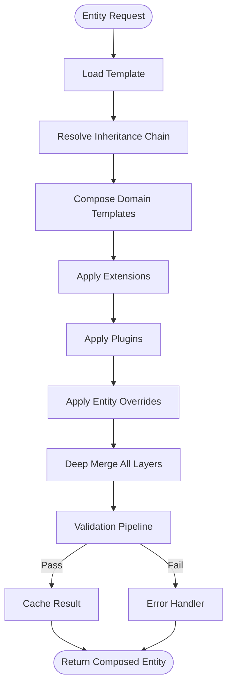
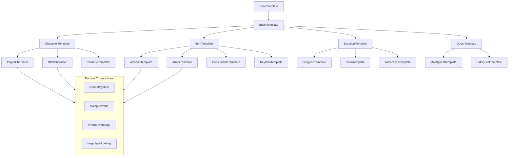
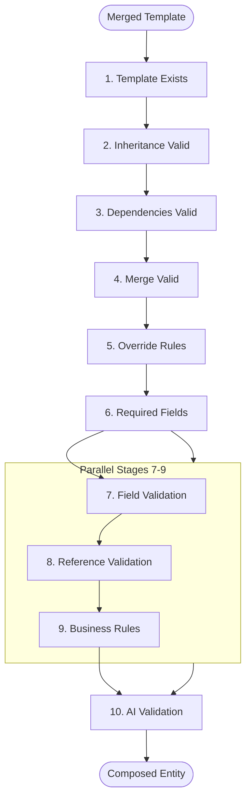
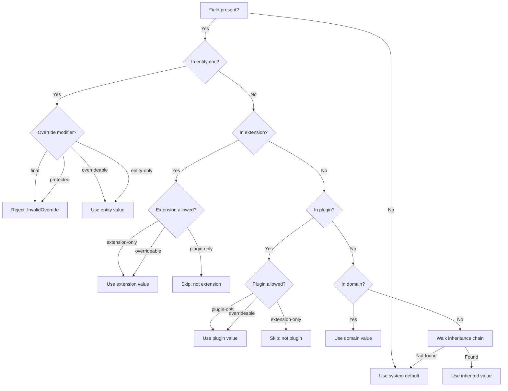
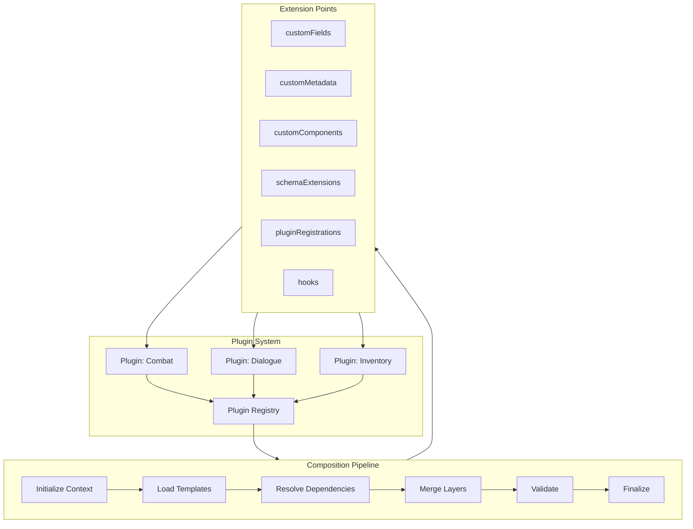

# Pipeline Diagrams

## (a) Full Composition Flow

## (b) Inheritance Tree (All Domain Types)

## (c) Validation Pipeline Detail

## (d) Override Resolution Decision Tree

## (e) Plugin Architecture with Extension Points

