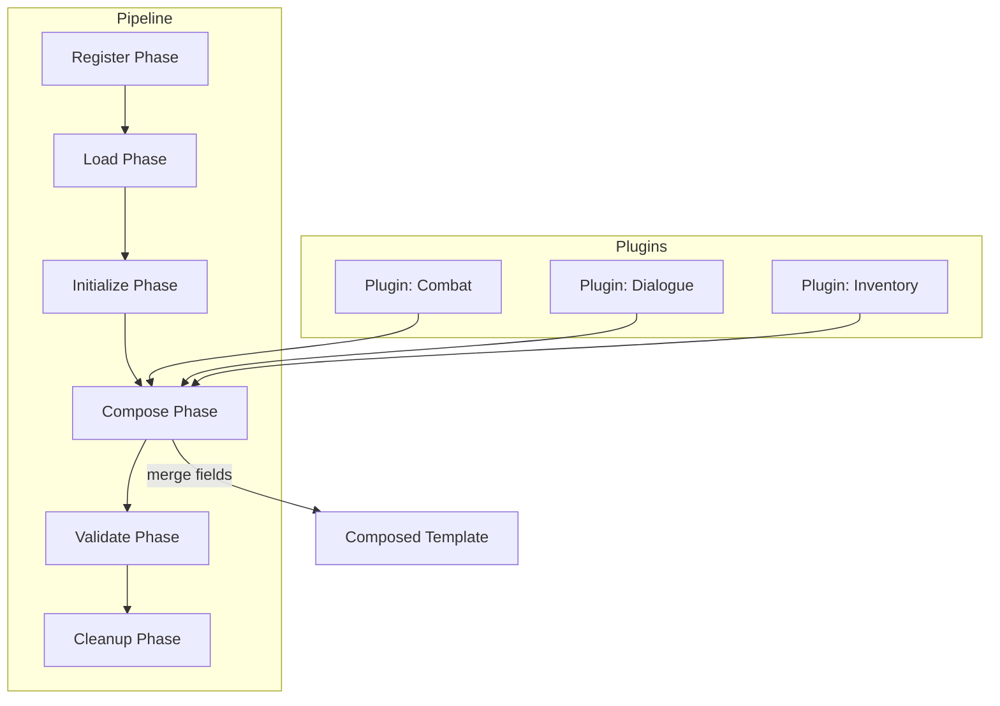

# Plugin Composition

## Plugin Lifecycle

```
register → load → initialize → compose → validate → cleanup
```

| Phase | Description |
|-------|-------------|
| `register` | Plugin announces identity, version, and capabilities |
| `load` | Plugin code/data is loaded into memory |
| `initialize` | Plugin sets up internal state |
| `compose` | Plugin contributes fields, components, or logic |
| `validate` | Plugin validates its contributed content |
| `cleanup` | Plugin releases resources |

## Plugin Isolation

- Each plugin runs in a scoped context with no access to other plugins' internals.
- Plugins communicate only through the composition context.
- Plugins cannot modify other plugins' registrations.

## Plugin Dependencies

```yaml
name: combat-effects
version: "1.2.0"
dependsOn:
  - name: combat-core
    version: ">=2.0"
  - name: animation-base
    version: "^1.5"
    optional: true
```

## Conflict Resolution

| Conflict | Resolution |
|----------|-----------|
| Same field, different value | Last-registered plugin wins |
| Same plugin, multiple versions | Highest compatible version |
| Plugin A depends on B, B on A | CircularDependency error |
| Plugin declares conflicting extension points | Reject with ExtensionConflict |

## Mermaid Plugin Architecture


