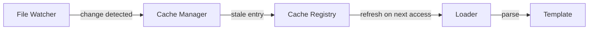

# Template Loading

## Loading Strategies

| Strategy | Behavior | Use Case |
|----------|----------|----------|
| **Eager** | Load all templates at startup | Small registries, deterministic environments |
| **Lazy** | Load on first request | Large registries, serverless deployments |
| **Cache-First** | Return cached copy, refresh async | High-throughput systems |
| **Registry-First** | Always load from registry | Distributed systems, hot-reload environments |

## Template Resolution

Templates are resolved by three mechanisms:

| Mechanism | Pattern | Example |
|-----------|---------|---------|
| By Name | Exact `$id` match | `entity/character/player` |
| By Prefix | Namespace match | `entity/character/*` |
| By Entity Type | `$type` field match | `type: player` |

## Resolution Order

1. Exact name match → return immediately.
2. Prefix match → return most specific match.
3. Entity type match → use template registry type index.
4. Fallback → `MissingTemplate` error.

## Cache Invalidation

| Trigger | Invalidation Scope |
|---------|-------------------|
| File change (watcher) | Single template + dependents |
| Registry webhook | Affected namespace |
| Manual reload API | Specific template(s) |
| TTL expiry | Expired entries only |
| Version change | Entire cache |

## Hot-Reload Specification

1. File watcher detects a change to a template file.
2. Cache entry for that template is marked stale.
3. All dependent templates in the dependency graph are also marked stale.
4. On next composition request, stale templates are reloaded.
5. If reload fails, old (stale) version is retained and a warning is emitted.

