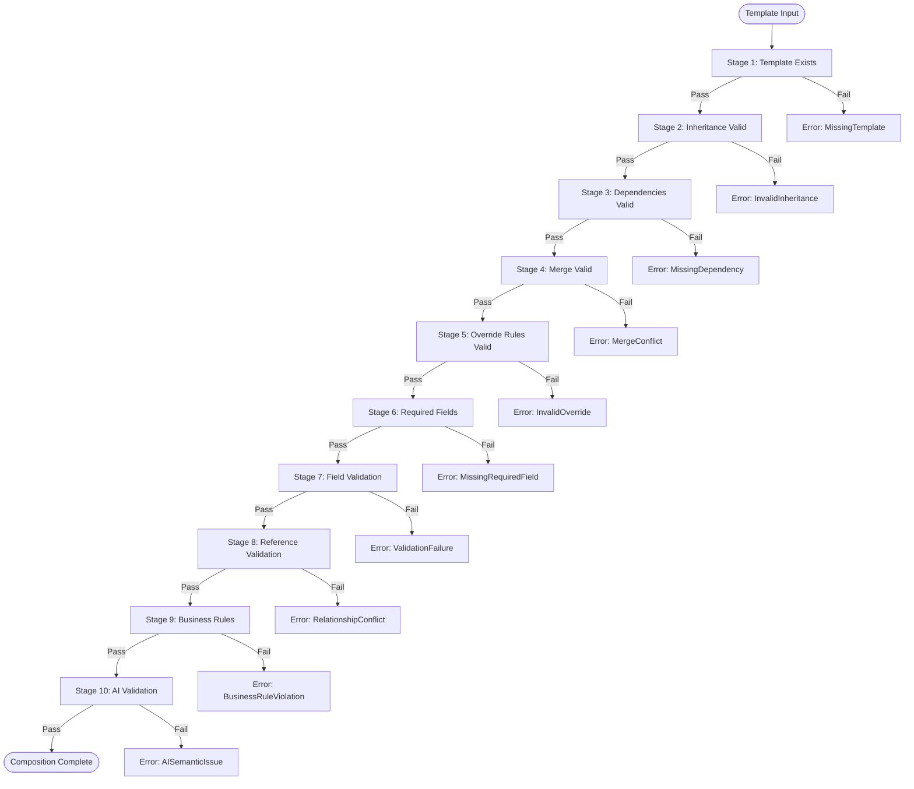

# Validation Pipeline

## 10-Stage Validation Sequence

| Stage | Name | Description |
|-------|------|-------------|
| 1 | Template Exists | Verify template file is accessible and parseable |
| 2 | Inheritance Valid | Parent template exists and chain is acyclic |
| 3 | Dependencies Valid | All required deps resolved, versions satisfied |
| 4 | Merge Valid | Merge operations completed without type errors |
| 5 | Override Rules Valid | No `final` fields overridden, modifiers respected |
| 6 | Required Fields | All `required` fields present after merge |
| 7 | Field Validation | Type checks, range checks, pattern validation |
| 8 | Reference Validation | Cross-template and cross-entity references resolve |
| 9 | Business Rules | Domain-specific logic rules (e.g., HP > 0) |
| 10 | AI Validation | LLM-based semantic consistency check |

## Mermaid Validation Flow

## Stage Configuration

Each stage can be individually enabled/disabled and configured with severity (`error`, `warning`, `info`).
