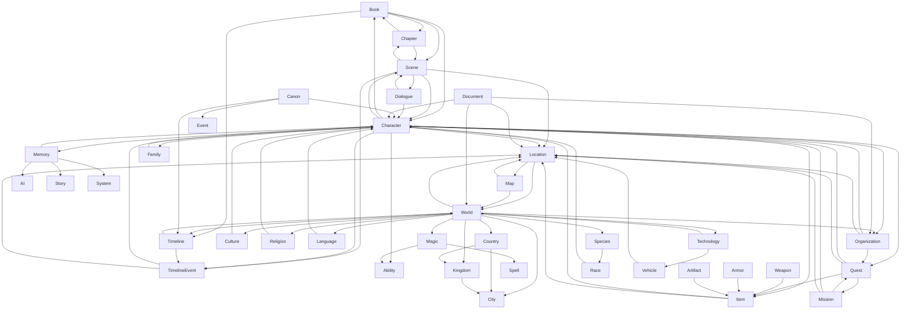
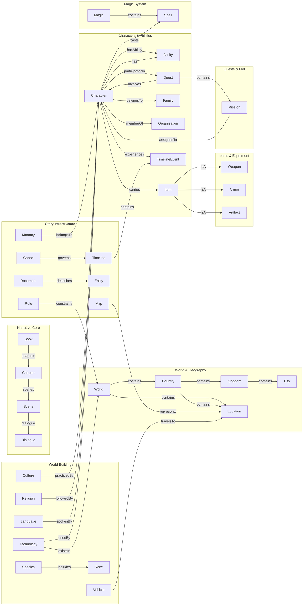

# Domain Template Architecture Diagrams

## 1. Domain Class Diagram

```mermaid
classDiagram
    class BaseEntity {
        +identifier: BaseIdentifier
        +metadata: BaseMetadata
        +audit: BaseAudit
        +version: BaseVersion
        +status: BaseStatus
        +lifecycle: BaseLifecycle
        +ownership: BaseOwnership
        +references: BaseReference
        +relationships: BaseRelationship
        +tags: BaseTag
        +visibility: BaseVisibility
        +permissions: BasePermission
        +localization: BaseLocalization
        +attachments: BaseAttachment
        +comments: BaseComment
        +history: BaseHistory
        +validation: BaseValidation
        +ai: BaseAI
        +search: BaseSearch
        +index: BaseIndex
        +security: BaseSecurity
        +export: BaseExport
        +import: BaseImport
        +workflow: BaseWorkflow
        +extension: BaseExtension
        +customProperties: object
    }

    class Character {
        +entity.appearance: object
        +entity.biography: object
        +entity.personality: object
        +entity.abilities: string[]
        +entity.inventory: string[]
        +entity.currentLocation: string
        +entity.books: string[]
        +entity.scenes: string[]
        +entity.timelineEvents: string[]
        +entity.narrativeRole: string
    }

    class Book {
        +entity.series: object
        +entity.structure: object
        +entity.wordCount: int
        +entity.genre: string[]
        +entity.themes: string[]
        +entity.pointOfView: string
        +entity.setting: object
        +entity.canonStatus: string
    }

    class Scene {
        +entity.number: int
        +entity.characters: string[]
        +entity.location: string
        +entity.timelinePosition: object
        +entity.dialogue: string[]
        +entity.mood: string
        +entity.purpose: string
    }

    class World {
        +entity.type: string
        +entity.cosmology: object
        +entity.geography: object
        +entity.history: array
        +entity.majorLocations: string[]
        +entity.countries: string[]
        +entity.cultures: string[]
    }

    class Organization {
        +entity.type: string
        +entity.headquarters: string
        +entity.leader: string
        +entity.members: string[]
        +entity.ranks: string[]
        +entity.allies: string[]
    }

    class Magic {
        +entity.type: string
        +entity.source: string
        +entity.rules: string
        +entity.spells: string[]
        +entity.schools: string[]
    }

    class Timeline {
        +entity.eras: array
        +entity.calendar: object
        +entity.events: string[]
    }

    class Item {
        +entity.category: string
        +entity.material: string
        +entity.value: object
        +entity.magical: boolean
        +entity.owner: string
    }

    class Memory {
        +entity.type: string
        +entity.ownerId: string
        +entity.importance: int
        +entity.decay: number
        +entity.consolidated: boolean
    }

    BaseEntity <|-- Character
    BaseEntity <|-- Book
    BaseEntity <|-- Chapter
    BaseEntity <|-- Scene
    BaseEntity <|-- Dialogue
    BaseEntity <|-- World
    BaseEntity <|-- Timeline
    BaseEntity <|-- TimelineEvent
    BaseEntity <|-- Location
    BaseEntity <|-- Country
    BaseEntity <|-- Kingdom
    BaseEntity <|-- City
    BaseEntity <|-- Organization
    BaseEntity <|-- Family
    BaseEntity <|-- Magic
    BaseEntity <|-- Spell
    BaseEntity <|-- Ability
    BaseEntity <|-- Item
    BaseEntity <|-- Weapon
    BaseEntity <|-- Armor
    BaseEntity <|-- Artifact
    BaseEntity <|-- Quest
    BaseEntity <|-- Mission
    BaseEntity <|-- Language
    BaseEntity <|-- Religion
    BaseEntity <|-- Culture
    BaseEntity <|-- Species
    BaseEntity <|-- Race
    BaseEntity <|-- Vehicle
    BaseEntity <|-- Technology
    BaseEntity <|-- Document
    BaseEntity <|-- Map
    BaseEntity <|-- Rule
    BaseEntity <|-- Canon
    BaseEntity <|-- Memory
```

## 2. Cross-Entity Dependency Map

```mermaid
graph TB
    Book --> Chapter
    Book --> Scene
    Book --> Character
    Book --> Timeline

    Chapter --> Scene
    Chapter --> Book

    Scene --> Character
    Scene --> Location
    Scene --> Dialogue
    Scene --> Chapter
    Scene --> TimelineEvent

    Dialogue --> Character
    Dialogue --> Scene

    Character --> Location
    Character --> Book
    Character --> Scene
    Character --> Ability
    Character --> Memory
    Character --> Family
    Character --> Organization
    Character --> Quest
    Character --> TimelineEvent
    Character --> Item

    World --> Location
    World --> Country
    World --> Kingdom
    World --> City
    World --> Culture
    World --> Religion
    World --> Language
    World --> Organization
    World --> Magic
    World --> Technology
    World --> Species
    World --> Timeline

    Country --> City
    Country --> Kingdom
    Kingdom --> City

    Location --> World
    Location --> Map

    Organization --> Character
    Organization --> Location
    Organization --> Quest

    Magic --> Spell
    Magic --> Ability

    Quest --> Mission
    Quest --> Character
    Quest --> Location
    Quest --> Item

    Mission --> Quest
    Mission --> Character
    Mission --> Location

    Timeline --> TimelineEvent
    Timeline --> World
    TimelineEvent --> Character
    TimelineEvent --> Location

    Item --> Character
    Item --> Location
    Weapon --> Item
    Armor --> Item
    Artifact --> Item

    Species --> Race
    Race --> Character
    Culture --> Character
    Religion --> Character
    Language --> Character

    Technology --> World
    Technology --> Vehicle
    Vehicle --> Location

    Family --> Character
    Canon --> Timeline
    Canon --> Character
    Canon --> Event

    Memory --> Character
    Memory --> AI
    Memory --> Story
    Memory --> System

    Map --> World
    Map --> Location

    Document --> Character
    Document --> World
    Document --> Location
    Document --> Organization
```

## 3. Entity Relationship Matrix

```mermaid
graph LR
    subgraph "Narrative Core"
        Book -- chapters --> Chapter
        Chapter -- scenes --> Scene
        Scene -- dialogue --> Dialogue
    end

    subgraph "Characters & Abilities"
        Character -- hasAbility --> Ability
        Character -- carries --> Item
        Character -- belongsTo --> Family
        Character -- memberOf --> Organization
        Character -- participatesIn --> Quest
        Character -- experiences --> TimelineEvent
    end

    subgraph "World & Geography"
        World -- contains --> Country
        Country -- contains --> Kingdom
        Kingdom -- contains --> City
        World -- contains --> Location
        Country -- contains --> Location
    end

    subgraph "Items & Equipment"
        Item -- isA --> Weapon
        Item -- isA --> Armor
        Item -- isA --> Artifact
    end

    subgraph "Magic System"
        Magic -- contains --> Spell
        Character -- casts --> Spell
        Character -- has --> Ability
    end

    subgraph "Quests & Plot"
        Quest -- contains --> Mission
        Quest -- involves --> Character
        Mission -- assignedTo --> Character
    end

    subgraph "Story Infrastructure"
        Canon -- governs --> Timeline
        Timeline -- contains --> TimelineEvent
        Rule -- constrains --> World
        Memory -- belongsTo --> Character
        Document -- describes --> Entity
        Map -- represents --> Location
    end

    subgraph "World Building"
        Culture -- practicedBy --> Character
        Religion -- followedBy --> Character
        Language -- spokenBy --> Character
        Species -- includes --> Race
        Technology -- usedBy --> Character
        Technology -- existsIn --> World
        Vehicle -- travelsTo --> Location
    end
```

## 4. Template Composition

```mermaid
graph TB
    subgraph "Base Layer (Phase 2.1)"
        BE[BaseEntity]
        BI[BaseIdentifier]
        BM[BaseMetadata]
        BA[BaseAudit]
    end

    subgraph "Domain Layer (Phase 2.2)"
        Char[Character.template.json]
        Book[Book.template.json]
        Scene[Scene.template.json]
        World[World.template.json]
        Item[Item.template.json]
        Org[Organization.template.json]
        Min35[... 28 more]
    end

    subgraph "Base Blocks (Reused)"
        BV[BaseVersion]
        BS[BaseStatus]
        BL[BaseLifecycle]
        BO[BaseOwnership]
        BR[BaseReference]
        BRel[BaseRelationship]
        BT[BaseTag]
        BVi[BaseVisibility]
        BLoc[BaseLocalization]
        BAtt[BaseAttachment]
        BVal[BaseValidation]
        BAI[BaseAI]
        BSe[BaseSearch]
        BHi[BaseHistory]
        BEx[BaseExtension]
    end

    BE --> BI
    BE --> BM
    BE --> BA
    BE --> BV
    BE --> BS
    BE --> BL
    BE --> BO
    BE --> BR
    BE --> BRel
    BE --> BT
    BE --> BVi
    BE --> BLoc
    BE --> BAtt
    BE --> BVal
    BE --> BAI
    BE --> BSe
    BE --> BHi
    BE --> BEx

    Char -.-> BE
    Book -.-> BE
    Scene -.-> BE
    World -.-> BE
    Item -.-> BE
    Org -.-> BE
    Min35 -.-> BE
```
