# Domain Template Framework

## Purpose

Reusable domain templates for every entity type in Storynaram. Each template inherits from the Base Template Framework (Phase 2.1) and adds only entity-specific fields.

## Design Principles

- **Inheritance** — Every domain template extends `BaseEntity` and inherits specific base blocks
- **Composition** — Domain templates use base blocks (identifier, metadata, audit, etc.) without duplication
- **Entity-Specific** — Only domain-specific fields appear in the `entity` property block
- **Placeholders** — All templates contain structure only, no story content
- **Reusable** — Each template can be instantiated thousands of times

## Domain Templates

| # | Template | Entity Type | Inherits From | Key Sections |
|---|----------|-------------|---------------|--------------|
| 1 | [Character](Character.template.json) | character | BaseEntity + 18 base blocks | Appearance, Biography, Personality, Abilities, Inventory, Narrative Role |
| 2 | [Book](Book.template.json) | book | BaseEntity + 18 base blocks | Series, Structure, Genre, POV, Setting, Canon Status |
| 3 | [Chapter](Chapter.template.json) | chapter | BaseEntity + 15 base blocks | Book, Number, Part, Scenes, Timeline, Locations |
| 4 | [Scene](Scene.template.json) | scene | BaseEntity + 16 base blocks | Characters, Location, Timeline, Dialogue, Mood, Purpose |
| 5 | [Dialogue](Dialogue.template.json) | dialogue | BaseEntity + 13 base blocks | Speakers, Lines, Language, Context, Subtext |
| 6 | [World](World.template.json) | world | BaseEntity + 18 base blocks | Cosmology, Geography, History, Magic, Technology |
| 7 | [Timeline](Timeline.template.json) | timeline | BaseEntity + 15 base blocks | Eras, Calendar, Events, Parallel Timelines |
| 8 | [TimelineEvent](TimelineEvent.template.json) | timeline-event | BaseEntity + 14 base blocks | Date, Participants, Causes, Consequences, Significance |
| 9 | [Location](Location.template.json) | location | BaseEntity + 17 base blocks | Type, World, Coordinates, Climate, Population |
| 10 | [Country](Country.template.json) | country | BaseEntity + 17 base blocks | World, Capital, Government, Economy, Military |
| 11 | [Kingdom](Kingdom.template.json) | kingdom | BaseEntity + 17 base blocks | World, Capital, Monarch, Succession, Royal House |
| 12 | [City](City.template.json) | city | BaseEntity + 17 base blocks | World, Type, Population, Districts, Governance |
| 13 | [Organization](Organization.template.json) | organization | BaseEntity + 18 base blocks | Type, Hierarchy, Members, Ranks, Alliances |
| 14 | [Family](Family.template.json) | family | BaseEntity + 15 base blocks | Type, Head, Members, Tree, Holdings |
| 15 | [Magic](Magic.template.json) | magic | BaseEntity + 15 base blocks | Type, Source, Rules, Spells, Schools |
| 16 | [Spell](Spell.template.json) | spell | BaseEntity + 13 base blocks | Magic, School, Tier, Incantation, Effect |
| 17 | [Ability](Ability.template.json) | ability | BaseEntity + 13 base blocks | Type, Source, Progression, Effects |
| 18 | [Item](Item.template.json) | item | BaseEntity + 15 base blocks | Category, Material, Value, Crafting |
| 19 | [Weapon](Weapon.template.json) | weapon | BaseEntity + 15 base blocks | Type, Material, Damage, Enchantments |
| 20 | [Armor](Armor.template.json) | armor | BaseEntity + 15 base blocks | Type, Material, Defense, Enchantments |
| 21 | [Artifact](Artifact.template.json) | artifact | BaseEntity + 15 base blocks | Type, Tier, Powers, Curse, Owners |
| 22 | [Quest](Quest.template.json) | quest | BaseEntity + 16 base blocks | Type, Objectives, Stages, Difficulty |
| 23 | [Mission](Mission.template.json) | mission | BaseEntity + 16 base blocks | Quest, Type, Objectives, Consequences |
| 24 | [Language](Language.template.json) | language | BaseEntity + 13 base blocks | Type, Script, Grammar, Vocabulary |
| 25 | [Religion](Religion.template.json) | religion | BaseEntity + 13 base blocks | Type, Deities, Beliefs, Rituals, Clergy |
| 26 | [Culture](Culture.template.json) | culture | BaseEntity + 13 base blocks | Type, Values, Customs, Social Structure |
| 27 | [Species](Species.template.json) | species | BaseEntity + 13 base blocks | Type, Classification, Abilities, Society |
| 28 | [Race](Race.template.json) | race | BaseEntity + 13 base blocks | Type, Species, Abilities, Homeland |
| 29 | [Vehicle](Vehicle.template.json) | vehicle | BaseEntity + 15 base blocks | Type, Crew, Weapons, Propulsion |
| 30 | [Technology](Technology.template.json) | technology | BaseEntity + 15 base blocks | Type, Era, Tier, Principles, Applications |
| 31 | [Document](Document.template.json) | document | BaseEntity + 17 base blocks | Type, Content, Format, Accessibility |
| 32 | [Map](Map.template.json) | map | BaseEntity + 17 base blocks | Type, Scale, Markers, Grid |
| 33 | [Rule](Rule.template.json) | rule | BaseEntity + 16 base blocks | Type, Scope, Statement, Exceptions |
| 34 | [Canon](Canon.template.json) | canon | BaseEntity + 16 base blocks | Type, Authority, Decisions, Inconsistencies |
| 35 | [Memory](Memory.template.json) | memory | BaseEntity + 16 base blocks | Type, Owner, Importance, Decay |

## Inheritance Structure

```mermaid
graph TD
    BE[BaseEntity] --> Char[Character]
    BE --> Book[Book]
    BE --> Chap[Chapter]
    BE --> Scene[Scene]
    BE --> Dia[Dialogue]
    BE --> World[World]
    BE --> TL[Timeline]
    BE --> TLE[TimelineEvent]
    BE --> Loc[Location]
    BE --> Country[Country]
    BE --> Kingdom[Kingdom]
    BE --> City[City]
    BE --> Org[Organization]
    BE --> Fam[Family]
    BE --> Magic[Magic]
    BE --> Spell[Spell]
    BE --> Abil[Ability]
    BE --> Item[Item]
    BE --> Wpn[Weapon]
    BE --> Armor[Armor]
    BE --> Art[Artifact]
    BE --> Quest[Quest]
    BE --> Miss[Mission]
    BE --> Lang[Language]
    BE --> Rel[Religion]
    BE --> Cult[Culture]
    BE --> Spec[Species]
    BE --> Race[Race]
    BE --> Veh[Vehicle]
    BE --> Tech[Technology]
    BE --> Doc[Document]
    BE --> Map[Map]
    BE --> Rule[Rule]
    BE --> Canon[Canon]
    BE --> Mem[Memory]

    style BE fill:#1a1a2e,stroke:#e94560,stroke-width:3px,color:#fff
```

## File Count

35 domain template JSON files + root README
