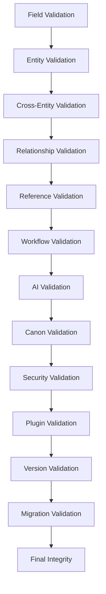

# Validation & Integration Framework

## Purpose

Unified validation and integration framework that governs every Storynaram template and workflow. Validates and integrates base templates, domain templates, AI templates, workflow templates, composition engine, registries, and future layers.

## Design Principles

- **Multi-level validation** — Field → Entity → Cross-entity → Workflow → AI → Canon → Security → Plugin → Version → Migration
- **Severity-graded** — Every validation result has a severity (critical, high, medium, low, info)
- **Recovery-aware** — Every error includes a recommended recovery strategy
- **Integration-first** — Designed to validate across layer boundaries

## Templates

| # | Template | Purpose |
|---|----------|---------|
| 1 | [ValidationRule](ValidationRule.template.json) | Single rule definition with severity and recovery |
| 2 | [ValidationProfile](ValidationProfile.template.json) | Named profile aggregating rules per entity type |
| 3 | [ValidationResult](ValidationResult.template.json) | Result with score, counts, errors, warnings |
| 4 | [ValidationError](ValidationError.template.json) | Error with severity, field, expected/actual |
| 5 | [ValidationWarning](ValidationWarning.template.json) | Warning with suggestion and code |
| 6 | [ValidationConstraint](ValidationConstraint.template.json) | Constraint — required, unique, conditional, temporal |
| 7 | [BusinessRule](BusinessRule.template.json) | Domain-specific business rule with expression |
| 8 | [ReferenceIntegrity](ReferenceIntegrity.template.json) | Orphan, dangling, cycle detection |
| 9 | [RelationshipIntegrity](RelationshipIntegrity.template.json) | Cardinality, bidirectionality, symmetry checks |
| 10 | [CanonIntegrity](CanonIntegrity.template.json) | Consistency, contradiction detection, importance |
| 11 | [WorkflowValidation](WorkflowValidation.template.json) | State machine, deadlock, coverage checks |
| 12 | [AIValidationProfile](AIValidationProfile.template.json) | Hallucination, canon, factual accuracy checks |
| 13 | [SecurityValidation](SecurityValidation.template.json) | Classification, encryption, redaction, compliance |
| 14 | [PermissionValidation](PermissionValidation.template.json) | Role, owner, group, inheritance checks |
| 15 | [VersionValidation](VersionValidation.template.json) | Compatibility, deprecation, breaking changes |
| 16 | [MigrationValidation](MigrationValidation.template.json) | Field mapping, data loss, rollback validation |
| 17 | [CompatibilityValidation](CompatibilityValidation.template.json) | Forward/backward compatibility analysis |
| 18 | [ExtensionValidation](ExtensionValidation.template.json) | Custom fields, overrides, conflict detection |
| 19 | [PluginValidation](PluginValidation.template.json) | Sandbox, resource, dependency, hook validation |
| 20 | [IntegrationProfile](IntegrationProfile.template.json) | Cross-layer integration with validation rules |

## Validation Levels

## Severity Model

| Level | Meaning | Recovery |
|-------|---------|----------|
| Critical | Data loss or corruption risk | Abort, manual fix required |
| High | Functional integrity compromised | Auto-fix or manual fix |
| Medium | Constraint violation | Flag for review |
| Low | Minor deviation | Auto-fix or skip |
| Info | Observation only | No action needed |
