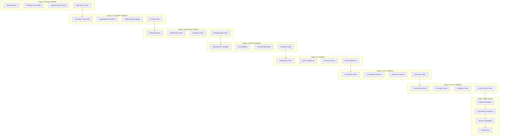
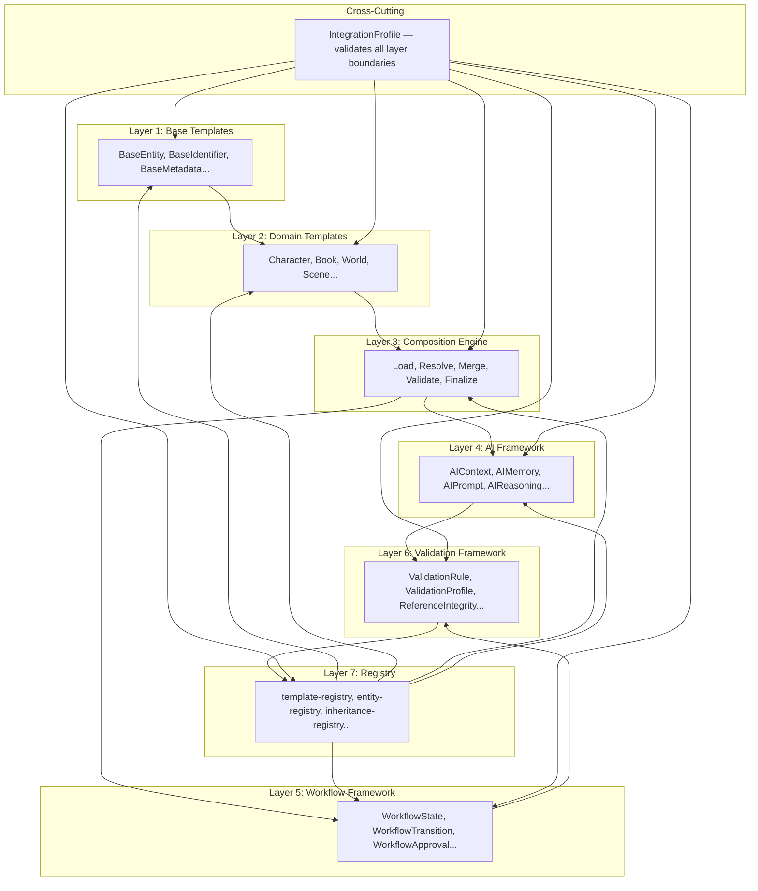
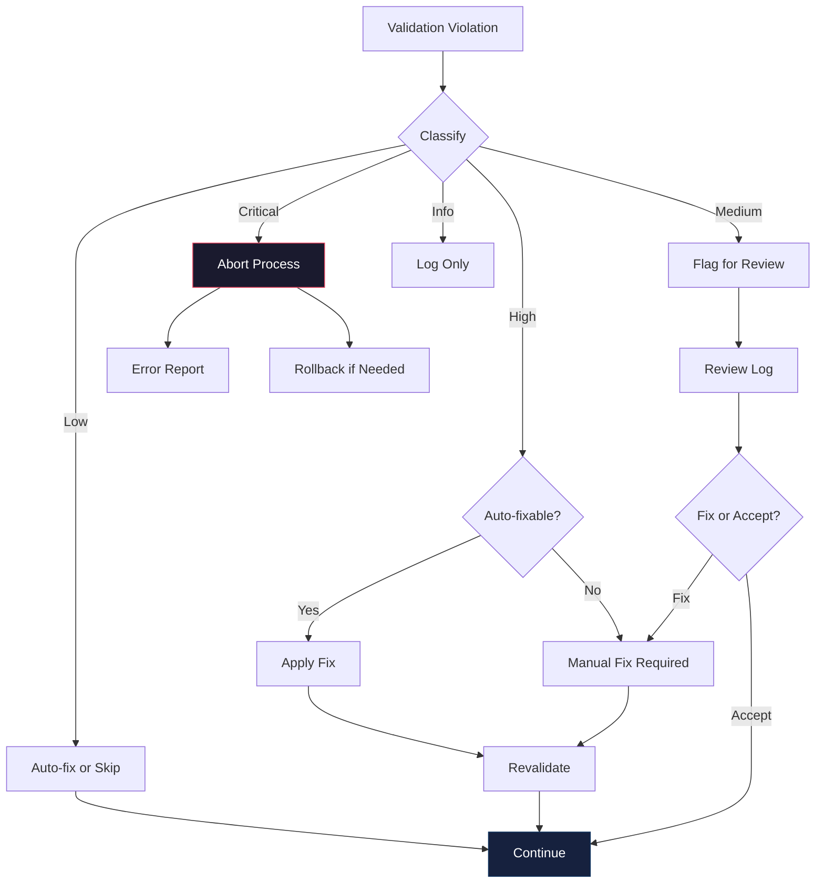
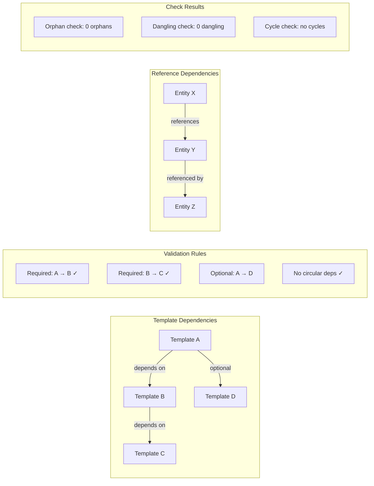
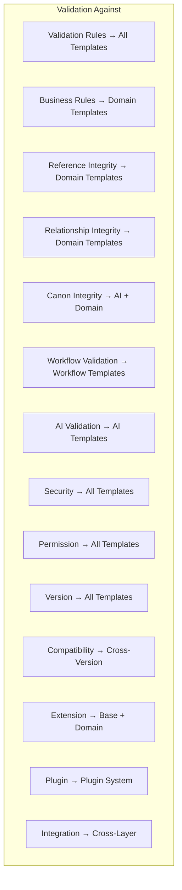

# Validation & Integration Diagrams

## 1. Complete Validation Pipeline

```mermaid
flowchart TD
    subgraph "Stage 1: Template Validation"
        T1[Template Exists]
        T2[Template Format Valid]
        T3[Required Fields Present]
        T4[Field Types Correct]
    end

    subgraph "Stage 2: Composition Validation"
        C1[Inheritance Chain Valid]
        C2[Dependencies Resolved]
        C3[Merge Strategy Applied]
        C4[Overrides Valid]
    end

    subgraph "Stage 3: Relationship Validation"
        R1[Cardinality Check]
        R2[Bidirectional Check]
        R3[Symmetry Check]
        R4[Strength Range Check]
    end

    subgraph "Stage 4: Workflow Validation"
        W1[State Machine Complete]
        W2[No Deadlocks]
        W3[All States Reachable]
        W4[Transitions Valid]
    end

    subgraph "Stage 5: AI Validation"
        A1[Hallucination Check]
        A2[Canon Compliance]
        A3[Factual Accuracy]
        A4[Format Adherence]
    end

    subgraph "Stage 6: Canon Validation"
        CN1[Consistency Check]
        CN2[Contradiction Detection]
        CN3[Importance Scoring]
        CN4[Verification Status]
    end

    subgraph "Stage 7: Security Validation"
        S1[Classification Check]
        S2[Encryption Check]
        S3[Redaction Check]
        S4[Access Control Check]
    end

    subgraph "Stage 8: Final Integrity"
        F1[Reference Integrity]
        F2[Cross-Entity Consistency]
        F3[Version Compatibility]
        F4[Overall Score]
    end

    T4 --> C1
    C4 --> R1
    R4 --> W1
    W4 --> A1
    A4 --> CN1
    CN4 --> S1
    S4 --> F1
    F1 --> F2 --> F3 --> F4
```

## 2. Integration Architecture

```mermaid
graph TB
    subgraph "Layer 1: Base Templates"
        BASE[BaseEntity, BaseIdentifier, BaseMetadata...]
    end

    subgraph "Layer 2: Domain Templates"
        DOMAIN[Character, Book, World, Scene...]
    end

    subgraph "Layer 3: Composition Engine"
        COMP[Load, Resolve, Merge, Validate, Finalize]
    end

    subgraph "Layer 4: AI Framework"
        AI[AIContext, AIMemory, AIPrompt, AIReasoning...]
    end

    subgraph "Layer 5: Workflow Framework"
        WF[WorkflowState, WorkflowTransition, WorkflowApproval...]
    end

    subgraph "Layer 6: Validation Framework"
        VAL[ValidationRule, ValidationProfile, ReferenceIntegrity...]
    end

    subgraph "Layer 7: Registry"
        REG[template-registry, entity-registry, inheritance-registry...]
    end

    subgraph "Cross-Cutting"
        INT[IntegrationProfile — validates all layer boundaries]
    end

    BASE --> DOMAIN
    DOMAIN --> COMP
    COMP --> AI
    COMP --> WF
    AI --> VAL
    WF --> VAL
    REG --> BASE
    REG --> DOMAIN
    REG --> COMP
    REG --> AI
    REG --> WF
    VAL --> REG
    INT --> BASE
    INT --> DOMAIN
    INT --> COMP
    INT --> AI
    INT --> WF
    INT --> REG
    INT --> VAL
```

## 3. Error Flow

```mermaid
graph TB
    VIOLATION[Validation Violation] --> CLASSIFY{Classify}
    CLASSIFY -->|Critical| ABORT[Abort Process]
    CLASSIFY -->|High| AUTO_FIX{Auto-fixable?}
    CLASSIFY -->|Medium| FLAG[Flag for Review]
    CLASSIFY -->|Low| AUTO_SKIP[Auto-fix or Skip]
    CLASSIFY -->|Info| LOG[Log Only]

    AUTO_FIX -->|Yes| APPLY[Apply Fix]
    AUTO_FIX -->|No| MANUAL[Manual Fix Required]

    APPLY --> REVALIDATE[Revalidate]
    MANUAL --> REVALIDATE
    FLAG --> REVIEW_LOG[Review Log]
    AUTO_SKIP --> CONTINUE[Continue]

    REVALIDATE --> CONTINUE
    REVIEW_LOG --> DECIDE{Fix or Accept?}
    DECIDE -->|Fix| MANUAL
    DECIDE -->|Accept| CONTINUE

    ABORT --> ERROR_REPORT[Error Report]
    ABORT --> ROLLBACK[Rollback if Needed]

    style ABORT fill:#1a1a2e,stroke:#e94560,color:#fff
    style CONTINUE fill:#16213e,stroke:#0f3460,color:#fff
```

## 4. Dependency Validation

```mermaid
graph LR
    subgraph "Template Dependencies"
        A[Template A] -->|depends on| B[Template B]
        B -->|depends on| C[Template C]
        A -->|optional| D[Template D]
    end

    subgraph "Validation Rules"
        V1[Required: A → B ✓]
        V2[Required: B → C ✓]
        V3[Optional: A → D]
        V4[No circular deps ✓]
    end

    subgraph "Reference Dependencies"
        E[Entity X] -->|references| F[Entity Y]
        F -->|referenced by| G[Entity Z]
    end

    subgraph "Check Results"
        H1[Orphan check: 0 orphans]
        H2[Dangling check: 0 dangling]
        H3[Cycle check: no cycles]
    end
```

## 5. Cross-Template Validation Matrix

```mermaid
graph TB
    subgraph "Validation Against"
        DIR[Validation Rules → All Templates]
        DIR2[Business Rules → Domain Templates]
        DIR3[Reference Integrity → Domain Templates]
        DIR4[Relationship Integrity → Domain Templates]
        DIR5[Canon Integrity → AI + Domain]
        DIR6[Workflow Validation → Workflow Templates]
        DIR7[AI Validation → AI Templates]
        DIR8[Security → All Templates]
        DIR9[Permission → All Templates]
        DIR10[Version → All Templates]
        DIR11[Compatibility → Cross-Version]
        DIR12[Extension → Base + Domain]
        DIR13[Plugin → Plugin System]
        DIR14[Integration → Cross-Layer]
    end
```
