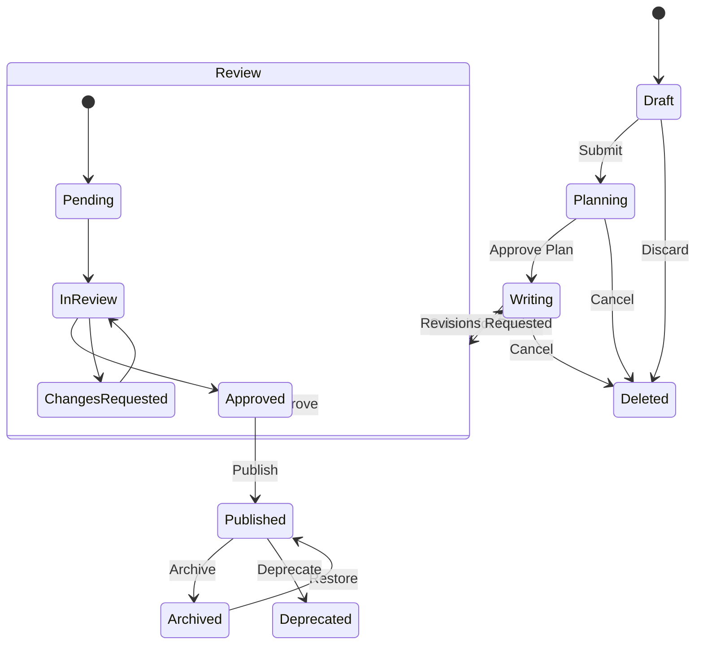
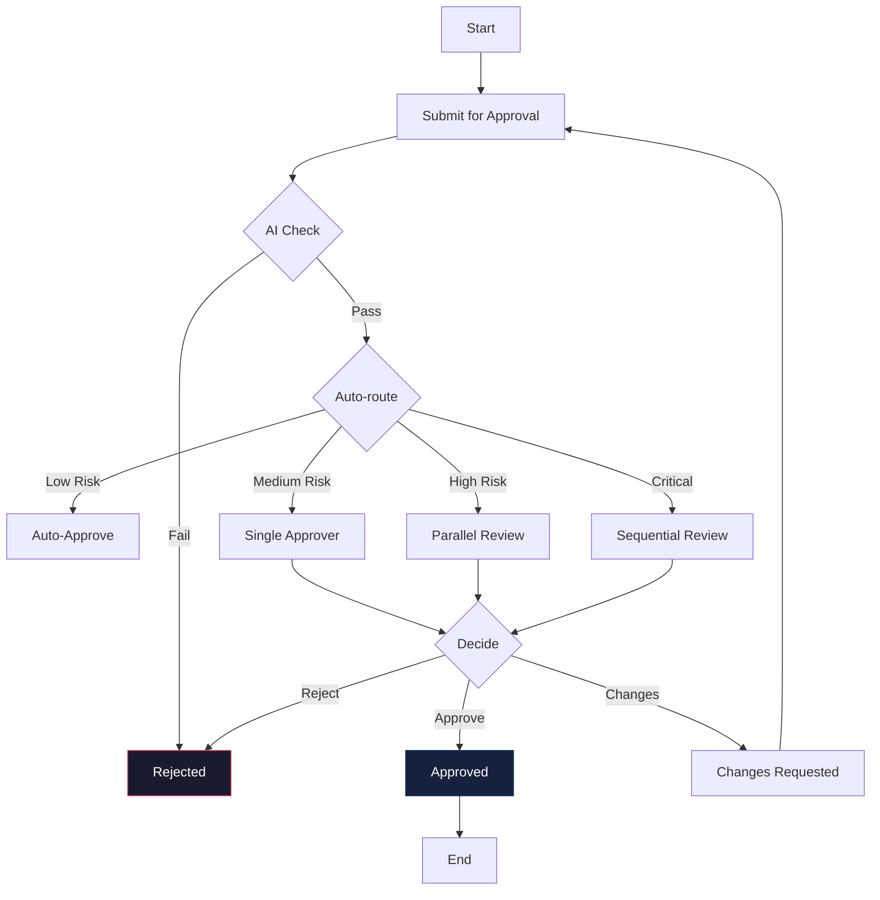
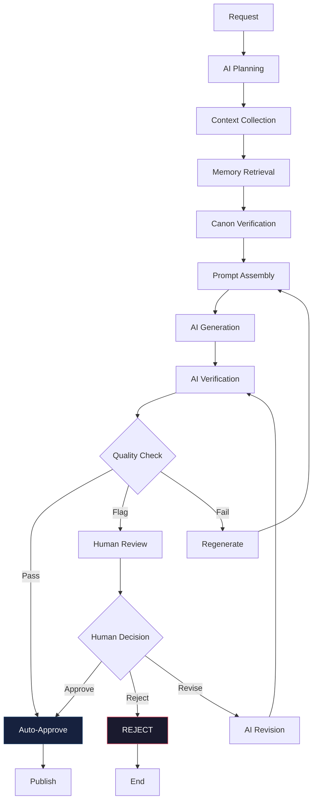
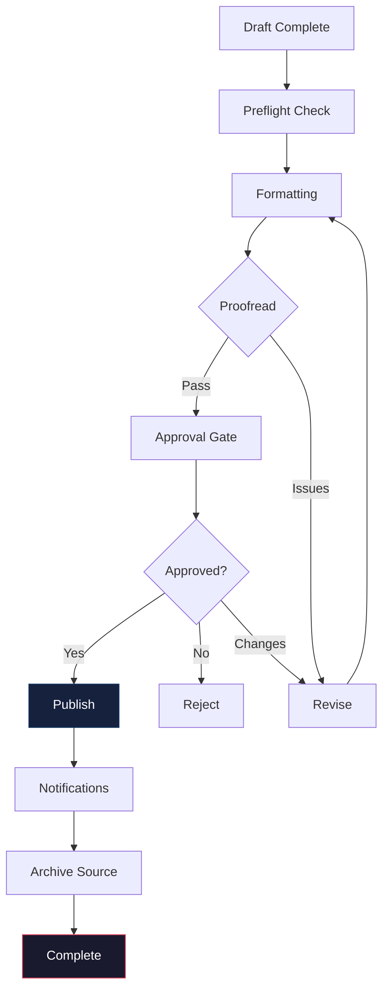
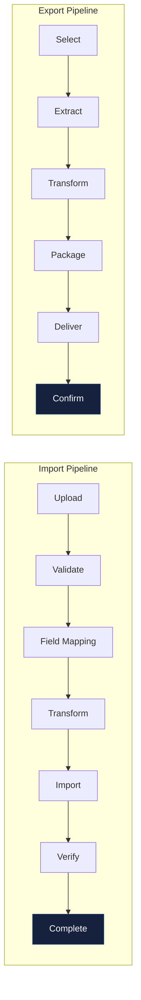

# Workflow Architecture Diagrams

## 1. Generic Workflow Lifecycle State Machine

## 2. Approval Flow

## 3. AI Content Generation Workflow

## 4. Publishing Workflow

## 5. Import / Export Workflow

## 6. Entity Type State Machines

```mermaid
graph TB
    subgraph "Character Lifecycle"
        CD[Draft] --> CP[Planning]
        CP --> CW[Writing]
        CW --> CR[Review]
        CR --> CA[Approved]
        CA --> CPUB[Published]
        CPUB --> CARCH[Archived]
    end

    subgraph "Book Lifecycle"
        BO[Outline] --> BD[Drafting]
        BD --> BE[Editing]
        BE --> BR[Review]
        BR --> BA[Approved]
        BA --> BPUB[Published]
    end

    subgraph "Scene Lifecycle"
        SO[Outlined] --> SW[Written]
        SW --> SR[Revised]
        SR --> SREV[Reviewed]
        SREV --> SL[Locked]
    end

    subgraph "Canon Review"
        CN[Submitted] --> CAI[AI Check]
        CAI --> CHR[Human Review]
        CHR --> CNA[Approved]
        CNA --> CNZ[Canonized]
    end
```

